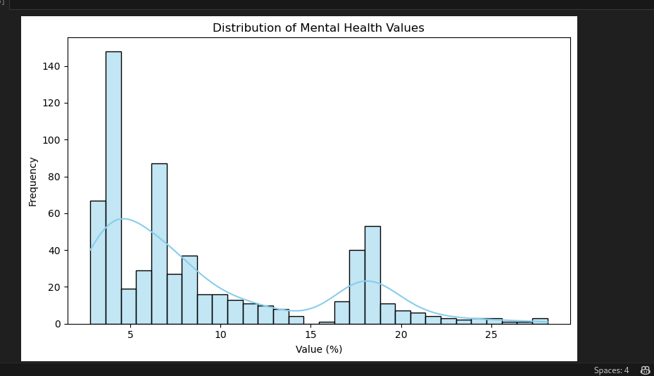
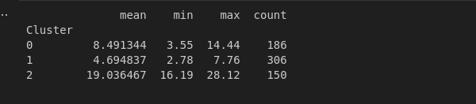

#  Mental Health Trends

## Project Overview

This capstone project investigates mental health trends across various regions, age groups, and mental health conditions, specifically within the technology industry. Using a real-world dataset, the project integrates Python analytics, machine learning models, and Power BI dashboards to derive meaningful insights.

---

## Dataset

- **Name:** `dmhasnsduhmh2018.csv`
- **Fields:** Age Range, Region, Mental Health Condition, Year, Value
- **Source:** `https://data.ctdata.org/dataset/mental-health`
- The dataset contains 864 rows and 7 columns, and it's related to mental health statistics across different regions, years, and age groups.
---

## Methodology
Cleaning Missing and Invalid Values
```python
import pandas as pd
import numpy as np

# Load dataset
df = pd.read_csv("dmhasnsduhmh2018.csv")

# Replace -6666.0 with NaN
df['Value'] = df['Value'].replace(-6666.0, np.nan)

# Drop rows with missing Value
df_clean = df.dropna(subset=['Value']).reset_index(drop=True)

df
```


Encoding Categorical Data
```python
from sklearn.preprocessing import LabelEncoder
# Encode categorical columns
categorical_cols = ['Region', 'Year', 'Age Range', 'Mental Health', 'Measure Type', 'Variable']
label_encoders = {}

for col in categorical_cols:
    le = LabelEncoder()
    df_clean[col] = le.fit_transform(df_clean[col])
    label_encoders[col] = le

print(df_clean.head(10))
df_clean.to_csv("cleaned_health_data.csv", index=False)
```


Descriptive Statistics

```python
 # Show general statistics for numerical column 'Value'
print("Descriptive statistics for 'Value':")
print(df_clean['Value'].describe())
image
Visualize Distributions
import matplotlib.pyplot as plt
import seaborn as sns

plt.figure(figsize=(8, 5))
sns.histplot(df_clean['Value'], kde=True, bins=30, color='skyblue')
plt.title('Distribution of Mental Health Values')
plt.xlabel('Value (%)')
plt.ylabel('Frequency')
plt.tight_layout()
plt.show()
```


Boxplot by Age Group
```python
plt.figure(figsize=(10, 6))
sns.boxplot(x='Age Range', y='Value', data=df_clean)
plt.title('Mental Health Value Distribution by Age Range')
plt.xticks(rotation=45)
plt.tight_layout()
plt.show()

```


Barplot – Average Mental Health Value by Condition
```python
plt.figure(figsize=(12, 6))
sns.barplot(y='Mental Health', x='Value', data=df_clean, estimator=np.mean, ci=None)
plt.title('Average Value by Mental Health Condition')
plt.xlabel('Average Value (%)')
plt.ylabel('Mental Health Condition')
plt.tight_layout()
plt.show()

```


Line Plot – Trends Over Time (if sorted by year)

```python
 # If Year is a string range like '2009-2010', extract the start year
df_clean['Start Year'] = df_clean['Year'].str[:4].astype(int)

# Plot trend of average value by year
plt.figure(figsize=(10, 5))
sns.lineplot(data=df_clean, x='Start Year', y='Value', estimator='mean')
plt.title('Average Mental Health Value Over Time')
plt.ylabel('Average Value (%)')
plt.xlabel('Year')
plt.tight_layout()
plt.show()

```


Applying a Clustering Model (Unsupervised Learning)

```python
from sklearn.preprocessing import LabelEncoder, StandardScaler
from sklearn.cluster import KMeans
import pandas as pd

# Step 1: Encode categorical features
df_encoded = df_clean.copy()
label_cols = ['Region', 'Year', 'Age Range', 'Mental Health', 'Measure Type', 'Variable']
label_encoders = {}

for col in label_cols:
    le = LabelEncoder()
    df_encoded[col] = le.fit_transform(df_encoded[col])
    label_encoders[col] = le

# Step 2: Feature selection
X = df_encoded[['Region', 'Year', 'Age Range', 'Mental Health', 'Value']]

# Step 3: Scale features
scaler = StandardScaler()
X_scaled = scaler.fit_transform(X)

# Step 4: Apply KMeans Clustering
kmeans = KMeans(n_clusters=3, random_state=42, n_init=10)
df_encoded['Cluster'] = kmeans.fit_predict(X_scaled)


```


 Visualize Clusters
 ```python

 import matplotlib.pyplot as plt

plt.figure(figsize=(8, 5))
plt.scatter(X_scaled[:, 0], X_scaled[:, -1], c=df_encoded['Cluster'], cmap='viridis')
plt.xlabel('Region (scaled)')
plt.ylabel('Value (scaled)')
plt.title('KMeans Clustering Results')
plt.show()
image
Inspect Cluster Characteristics
# Average value per cluster
cluster_summary = df_encoded.groupby('Cluster')['Value'].agg(['mean', 'min', 'max', 'count'])
print(cluster_summary)
imagedef assign_risk_level(value):
    """Categorize value into mental health risk levels."""
    if value < 5:
        return 'Low'
    elif 5 <= value < 15:
        return 'Medium'
    else:
        return 'High'

# Apply to clean dataset
df_clean['Risk Level'] = df_clean['Value'].apply(assign_risk_level)

# Preview
df_clean[['Value', 'Risk Level']].head()
```


Inspect Cluster Characteristics

```python
# Average value per cluster
cluster_summary = df_encoded.groupby('Cluster')['Value'].agg(['mean', 'min', 'max', 'count'])
print(cluster_summary)
```


```python
def assign_risk_level(value):
    """Categorize value into mental health risk levels."""
    if value < 5:
        return 'Low'
    elif 5 <= value < 15:
        return 'Medium'
    else:
        return 'High'

# Apply to clean dataset
df_clean['Risk Level'] = df_clean['Value'].apply(assign_risk_level)

# Preview
df_clean[['Value', 'Risk Level']].head()

```

Risk levels
```python
import seaborn as sns
import matplotlib.pyplot as plt

sns.countplot(x='Risk Level', data=df_clean, palette='viridis')
plt.title('Distribution of Risk Levels')
plt.show()
```


saving cleaned dataset

```python
df_clean.to_csv("cleaned_mental_health_data.csv", index=False)
print("Cleaned data saved as 'cleaned_mental_health_data.csv'")
```


##POWERBI DASHBOARD
- Pages: Summary, Risk Drill, Region View,

summary age consists of all basic graphs here is a screenshot


Region drill page here is a screenshot


Risk analysis page for analyzing risks here is a screen shot


Toolit is also present here is a screenhot


 prepared by: Ruterana Gloire
 feel free to reach out on my e-mail : ruterana47@gmail.com
